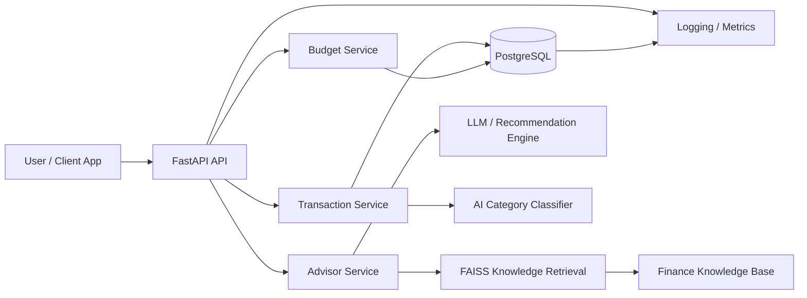
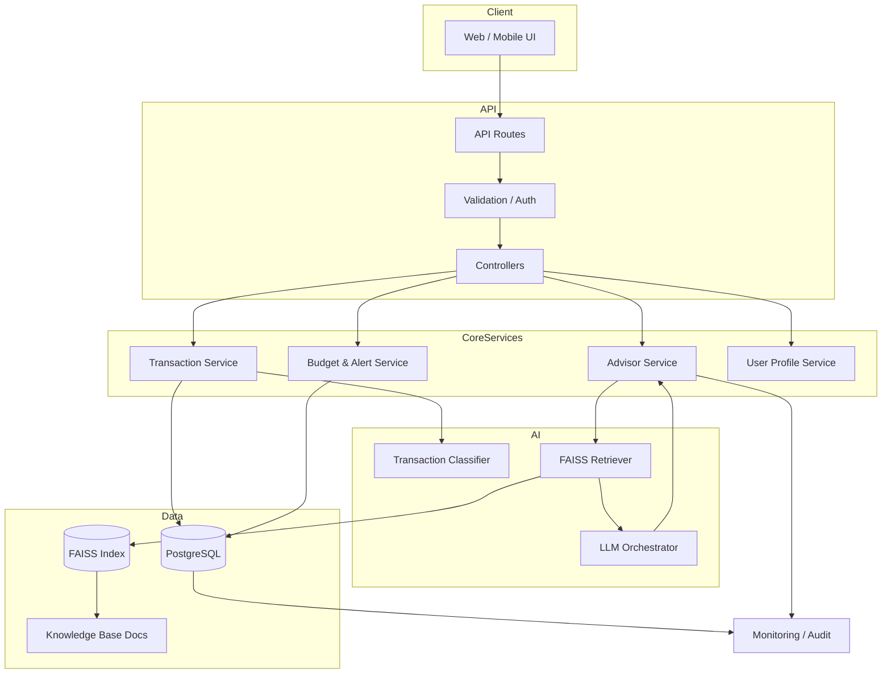
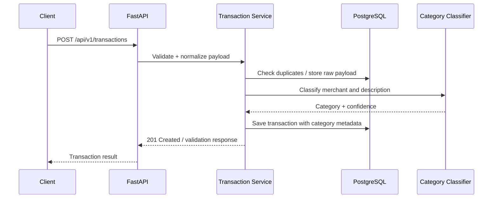
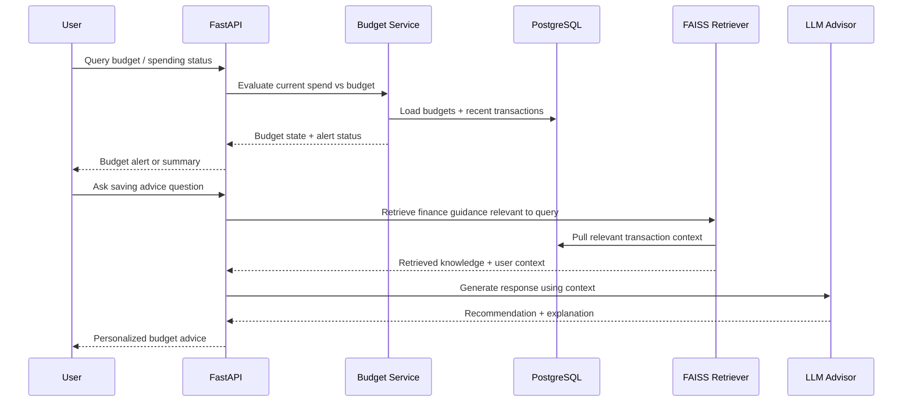

# AI Expense Advisor — High-Level Architecture

## 1. Purpose and Goals
The AI Expense Advisor is a personal finance assistant designed to help users manage expenses, detect budget risk, and receive contextual financial guidance. The system combines transactional data processing, AI categorization, and retrieval-based advice generation so users can act on financial habits in near real time.

The architecture is shaped by the requirements in the product backlog:
- US-001: Automated Transaction Ingestion & Categorization
- US-002: Personalized Budget Alerts & RAG Advisor

The solution emphasizes:
- secure and privacy-aware personal finance handling
- low-latency API interactions
- explainable AI-generated spending advice
- reliable persistence for transactions and budgets
- modular service boundaries for future extensibility

---

## 2. Architectural Principles
1. Separation of concerns
   - API layer, application services, AI orchestration, and storage are kept distinct.
2. Privacy by design
   - Finance data is restricted by user ownership and access controls.
3. Explainable AI
   - Recommendations should be traceable to transaction history and retrieved knowledge.
4. Low latency for core actions
   - Transaction ingestion and budget checks aim for sub-200 ms response times in the standard path.
5. Reliability and observability
   - Errors, alerts, model outputs, and ingestion events are logged and monitored.
6. Extensibility
   - New categories, budget policies, retrieval sources, or frontends can be added without redesigning the core domain.

---

## 3. High-Level System Components

### 3.1 Presentation Layer
- Web or mobile client for user dashboard, transactions, budgets, and alerts
- Optional admin or internal operations UI

### 3.2 API Layer
- FastAPI application exposes authenticated endpoints for:
  - transaction ingestion
  - transaction listing and querying
  - budget configuration
  - budget checks and alerts
  - advisor questions and RAG responses

### 3.3 Application Services
- Transaction service
- Budget service
- Alerts service
- AI classification service
- RAG advisor service
- User profile and authorization service

### 3.4 Data Layer
- PostgreSQL as the primary transactional database
- SQLAlchemy as ORM and query layer
- FAISS vector store for knowledge retrieval in the finance advisor
- File or object storage for uploaded documents or reference material if needed

### 3.5 AI Layer
- Classification model or rules engine for expense tagging
- Retrieval pipeline for finance knowledge and saving advice
- LLM orchestration for summarization and recommendation generation

### 3.6 Observability and Security
- Structured logging
- metrics and tracing
- authentication and authorization middleware
- encryption at rest / in transit support
- audit trail for financial operations

---

## 4. Technology Choices

### FastAPI
FastAPI is selected for the API layer because it provides:
- high performance and efficient async support
- automatic request validation and OpenAPI documentation
- easy integration with SQLAlchemy, authentication middleware, and service orchestration
- straightforward support for REST endpoints required by US-001 and US-002

### PostgreSQL
PostgreSQL is the authoritative data store for:
- user records
- transaction history
- budget thresholds and categories
- alert state and metadata
- audit and compliance objects

It is well suited to structured relational data, transaction-safe writes, and reporting patterns.

### SQLAlchemy
SQLAlchemy is used to manage:
- ORM models for transactions, budgets, and users
- database session handling
- query composition and data integrity checks
- schema evolution and testability

### FAISS for RAG
FAISS is selected as the vector store for the knowledge layer because it provides:
- fast similarity search in embedding space
- efficient retrieval of finance guidance and saving tips
- scalability for a growing knowledge base of budget guidance, articles, and policy texts

The RAG workflow retrieves the most relevant context before generating an answer or recommendation.

---

## 5. System Context Diagram

This architecture separates user interactions from domain logic and allows each major workflow to be independently tested and refined.

---

## 6. Component Architecture

---

## 7. Data Model Overview
The core persistence model contains a small set of relational entities:
- User
  - id
  - email
  - preferences
  - created_at
- Transaction
  - id
  - user_id
  - amount
  - currency
  - merchant
  - transaction_date
  - raw_description
  - category
  - confidence_score
  - source
  - created_at
- Budget
  - id
  - user_id
  - category
  - monthly_limit
  - alert_threshold
  - created_at
- AlertLog
  - id
  - user_id
  - budget_id
  - alert_type
  - trigger_value
  - message
  - created_at
- KnowledgeArticle
  - id
  - title
  - content
  - tags
  - source
  - version

These structures support both event-based transaction processing and knowledge-based advice generation.

---

## 8. Data Flow for US-001: Automated Transaction Ingestion & Categorization

### Flow
1. Client submits transaction payload to POST /api/v1/transactions.
2. FastAPI validates the request schema and auth context.
3. The transaction service normalizes values such as currency, date, merchant, and amount.
4. Duplicate detection and basic validation checks run before persistence.
5. The AI classification service assigns a category based on merchant, description, and historical patterns.
6. The transaction is stored in PostgreSQL with metadata and confidence score.
7. The system returns a structured response with transaction ID, category, and status.
8. Logs and metrics capture execution time, ingestion errors, and classification confidence.

### Sequence Diagram

### Design Notes
- The transaction table remains the source of truth for financial records.
- AI classification is treated as a helper service rather than replacing core transactional data handling.
- The system can support batch ingestion by iterating the same workflow for multiple transactions in one request.

---

## 9. Data Flow for US-002: Personalized Budget Alerts & RAG Advisor

### Flow
1. The budget service continuously compares transaction totals against user-defined thresholds.
2. When spending is near or beyond a configured threshold, an alert is generated.
3. The alert message includes current spending, remaining budget, and context from recent transactions.
4. A user can ask a spending or savings question through the advisor API.
5. The RAG service embeds the question and queries FAISS for similar finance knowledge entries.
6. Relevant knowledge snippets are retrieved and combined with recent transaction context.
7. The LLM or advisor orchestration builds a budget-aware, explainable recommendation.
8. The result is returned with references to the retrieved knowledge and transaction context.

### Sequence Diagram

### Design Notes
- Budget alerts are generated from transactional data and configured limits rather than from static heuristics alone.
- The RAG layer grounds responses in a curated finance knowledge base so advice is not entirely model-generated.
- User advice must remain safe and explainable, especially for financial decisions.

---

## 10. Security and Privacy Considerations
The system must treat personal finance data as sensitive. The architecture includes:
- authentication and session management for user-specific access
- role-based authorization for budget and transaction operations
- encryption for data in transit and at rest where supported
- data minimization and retention policies aligned with GDPR requirements
- audit logging for access, update, and deletion actions
- user data export and deletion support as part of compliance readiness

---

## 11. Observability and Reliability
The architecture includes:
- structured logs for API calls, ingestion outcomes, budget checks, and AI retrieval activity
- metrics for latency, category classification success, alert volume, and error rates
- tracing across API, service, database, and AI retrieval calls
- retry and circuit-breaker patterns for external LLM or retrieval dependencies
- graceful fallback logic when AI classification or retrieval is temporarily unavailable

---

## 12. Deployment View
A practical deployment model for this system is:
- API service in a containerized environment
- PostgreSQL database in a managed or self-hosted deployment
- FAISS index served as a local or managed vector service
- model-serving component for classification and generation tasks
- monitoring stack for logs, metrics, and alerting

This supports a clean path from local development to a production deployment without major structural changes.

---

## 13. Summary
The proposed architecture balances user value and technical rigor. It keeps transaction processing reliable, budget insights responsive, and AI guidance grounded in both user-specific data and retrieval-based financial knowledge. The design supports the two critical user stories while remaining modular enough for future growth.
